# AI_YOLO

โปรเจกต์สำหรับการพัฒนาโมเดลปัญญาประดิษฐ์ด้วย **YOLO26** สำหรับตรวจจับและจำแนกวัตถุจากภาพ วิดีโอ และกล้องแบบ Real-time โดยใช้ **Ultralytics YOLO** ร่วมกับ **Label Studio** สำหรับสร้าง Dataset และกำหนด Bounding Box


drive สำหรับโหลด Video Dataset, Test image และ Video test
: https://drive.google.com/drive/folders/1ERlu3liw6lM2_fEC7ENjsPka92Qg8upJ?usp=sharing

---

## 📂 Project Structure

```text
AI_YOLO/
├── README.md
├── env/
├── dataset/
│   ├── images/
│   │   ├── train/
│   │   └── val/
│   ├── labels/
│   │   ├── train/
│   │   └── val/
│   ├── classes.txt
│   └── data.yaml
│
├── yolo26n.pt
├── data.yml
├── requirements.txt
│
├── 01-export_dataset.py
├── 02-train.py
├── 03-test_image.py
├── 04-test_video.py
└── 05-test-camera.py
```

โครงสร้างไฟล์หลักของโปรเจกต์ประกอบด้วยไฟล์สำหรับ Export Dataset, Training และการทดสอบโมเดลทั้งภาพ วิดีโอ และกล้อง

---

## 2. Install Environment

```bash
pip install -U ultralytics
pip install opencv-python matplotlib
```

---

## 3. Install PyTorch สำหรับ NVIDIA GPU

หากใช้งาน **Windows + NVIDIA GPU + CUDA 12.1** สามารถติดตั้ง PyTorch ด้วยคำสั่ง

```bash
pip install torch torchvision torchaudio --index-url https://download.pytorch.org/whl/cu121
```

> หากใช้งาน CPU หรือ macOS ไม่จำเป็นต้องใช้คำสั่ง CUDA นี้

---

# 🏷️ Image Labeling

โปรเจกต์นี้ใช้ **Label Studio** สำหรับสร้าง Bounding Box และกำหนด Class ของวัตถุ

สามารถดาวน์โหลด Label Studio ได้จากเว็บไซต์ทางการ: [Label Studio](https://labelstud.io?utm_source=chatgpt.com)

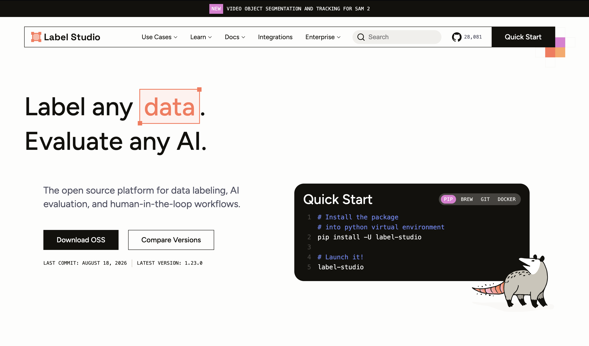

จากนั้นทำตามขั้นตอน Quick Start ได้เลย แต่อย่าพึ่ง Launch Label studio ขึ้นมา ต้องเซ็ตระบบให้มันก่อน โดยเริ่มจากการเปิด Cmd ขึ้นมา สร้างโฟลเดอร์ และ env ให้เรียบร้อย โดยสร้างได้จากโค้ดนี้

---

# ⚙️ Installation

## 1. สร้าง Project Folder
เข้าไปในโฟลเดอร์เป้าหมายก่อน หรือถ้าไม่มีให้สร้างโฟลเดอร์ก่อนแล้วเข้าไปเพื่อสร้าง env แล้ว activate   
เปิด Command Prompt หรือ Terminal แล้วใช้คำสั่ง

```bash
mkdir AI_YOLO
cd AI_YOLO
python -m venv env
```

## 2. สร้าง Virtual Environment และ Activate Virtual Environment


### Windows

```bash
py -3 -m venv env
.\env\Scripts\activate.bat
```

### macOS

```bash
python3 -m venv env
source ./env/bin/activate
```

เมื่อ Activate สำเร็จ จะเห็นชื่อ

```text
(env)
```

---

## 3. ติดตั้ง Dependencies
ต่อไปจะต้องติดตั้ง Package python  โดยทำตามขั้นตอนนี้ได้เลย   

Upgrade pip:

```bash
python.exe -m pip install --upgrade pip
```

Install requirements (ดาวน์โหลด `requirements.txt` แล้ววางไว้ในโฟลเดอร์ของเราก่อน ที่เปิด env ไว้)

```bash
pip install -r requirements.txt
```

ตอนนี้เครื่องมือพร้อมแล้ว ต่อไปจะเป็นการทำ Image Labeling   

---

# 🎞️ Extract Frame จาก Video

ทำการ winget install ffmpeg ก่อน แล้วรอโหลดจนเสร็จ ตัวนี้จะใช้แยก frame จาก video   

```bash
winget install ffmpeg
```

จากนั้นเปิด Vs Code ได้เลย

```bash
code .
```

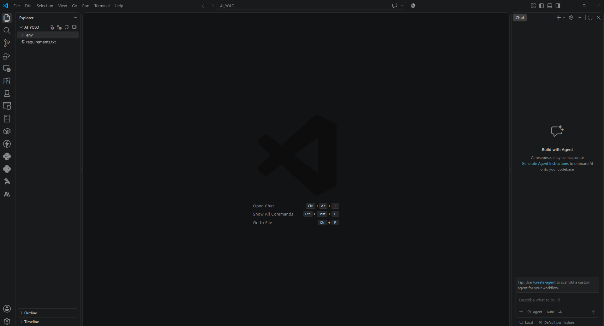
   
จากนั้นสร้างโฟลเดอร์สำหรับการจัดเก็บ Frame รูปภาพที่จะได้จากการ Extract Frame จาก Video ละเพิ่มไฟล์วิดีโอที่ดาวน์โหลดมาเข้าไป ลากไปวางใน Vs Code ได้เลย   

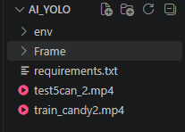

จากนั้นกลับไปที่ cmd แล้วใช้คำสั่ง 

```bash
ffmpeg -i train_candy2.mp4 -vf fps=2 frame/images/%04d.jpg
```

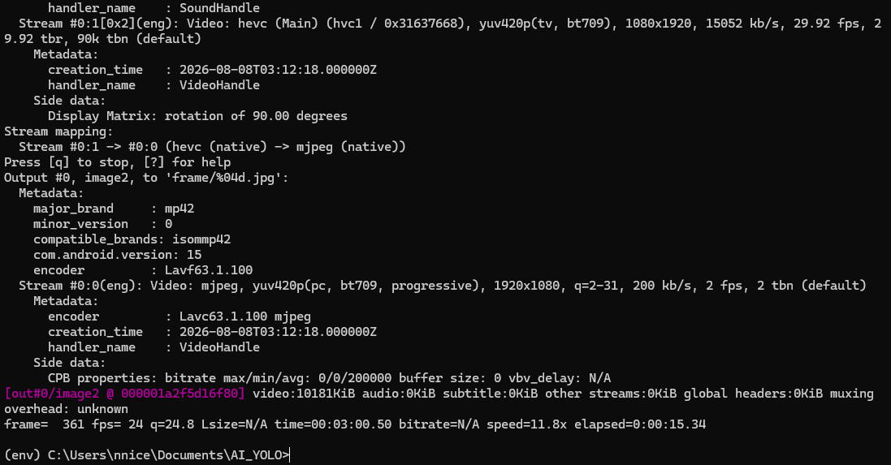

โดยโค้ดนี้มีความหมายดังนี้ สามารถแก้ไขได้ ถ้ารันไม่ได้ลองปิดแล้วเปิดใหม่ทั้ง Vs Code และ cmd   

### ความหมายของคำสั่ง

| คำสั่ง                  | รายละเอียด                                |
| ----------------------- | ----------------------------------------- |
| `ffmpeg -i`             | เรียกใช้คำสั่ง ffmpeg ที่ใช้แยก frame ออกมาเป็นรูปภาพจาก Video |
| `train_candy2.mp4`      | ชื่อไฟล์ Video (สามารถเปลี่ยนได้หากชื่อไม่ตรง)                 |
| `-vf fps=2`             | กำหนดให้ใช้ตัวกรองวิดีโอ แล้วกำหนดให้ดึงภาพออกมา 2 เฟรมต่อวินาที (แก้ไขได้)   |
| `frame/images/%04d.jpg` |  ตั้งชื่อเฟรมภาพที่แยกออกมา ไปใส่ในโฟลเดอร์ frame/images บันทึกภาพเป็น `0001.jpg`, `0002.jpg`, ... |

*สามารถเปลี่ยน `fps=2` ได้ตามความเหมาะสมของ Dataset*

ตอนนี้จะได้รูปมาแล้ว จากนั้นจะเริ่มทำ Label แล้ว เปิดหน้า cmd ขึ้นมาใหม่ 1 หน้า เพื่อใช้รัน Label studio   

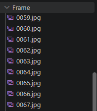

---

# 🖼️ เริ่ม Label ด้วย Label Studio

เปิด Command Prompt อีกหนึ่งหน้าต่าง และ Activate Environment

โดยก่อนการรัน Label Studio จะต้อง Set คำสั่งนี้ก่อน   

```cmd
set NLTK_DISABLE_IMPORT_SECURITY=1
set LABEL_STUDIO_LOCAL_FILES_SERVING_ENABLED=true
set LABEL_STUDIO_LOCAL_FILES_DOCUMENT_ROOT=C:\Users\YOUR_USERNAME\Documents\AI_YOLO
```

> path ที่มีโฟล์เดอร์ Frame อยู่ ของตัวอย่างเป็น C:\Users\nnice\Documents\AI_YOLO สามารถเปลี่ยนได้   

---

### จากนั้นรัน label-studio start แล้วสักพักจะเด้งหน้า localhost มาให้ แต่ต้องเปิดหน้า cmd นี้ไว้ ***ห้ามปิด***   

```bash
label-studio start
```

ระบบจะเปิดหน้า Localhost สำหรับใช้งาน Label Studio

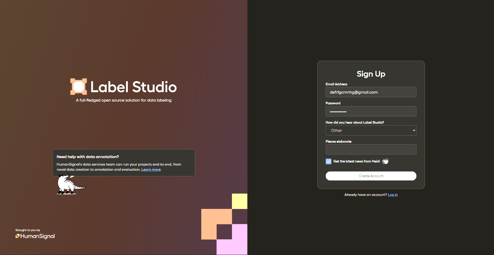

> Command Prompt ที่ใช้รัน Label Studio ต้องเปิดค้างไว้   
   
> การเข้าใช้งานครั้งแรก ต้อง Sign Up  ก่อน Email Password mockup ขึ้นมาเองได้เลย ไม่จำเป็นต้องใส่ Email จริงๆ แต่ต้องจำรหัส และ Email ไว้ด้วยเผื่อการใช้งานครั้งถัดไป

---   
   
# 🏷️ ตั้งค่า Labeling

เมื่อเข้าสู่ Label Studio ครั้งแรก ให้สร้าง Project ใหม่ด้วย


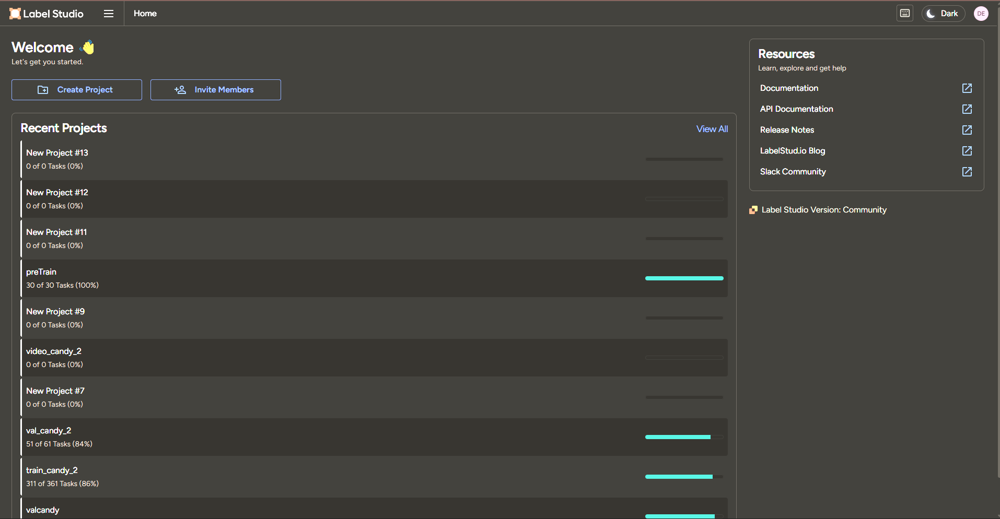

นี่คือหน้าแรกของ Label Studio หากเข้ามาครั้งแรกจะไม่มีโปรเจคแบบนี้ จากนั้นกด Create Project 

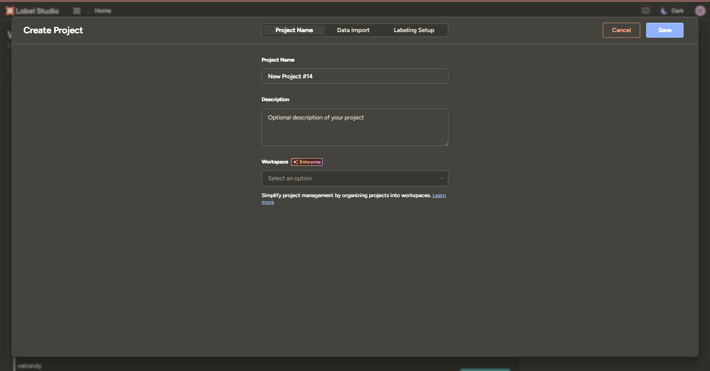

ตั้งชื่อโปรเจคต่างๆ ไว้ได้เลย แล้วส่วนนี้เราจะข้าม Data import ไปก่อน แล้วไปหน้า Labeling Setup

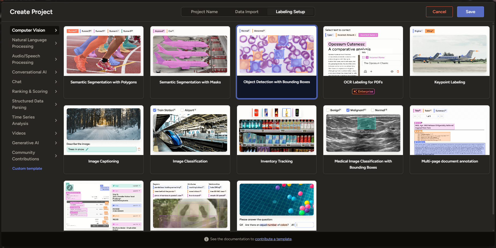

ในการทำ object detection ครั้งนี้จะใช้ Object Detection with Bounding Boxes  แล้ว Save ไว้ก่อน

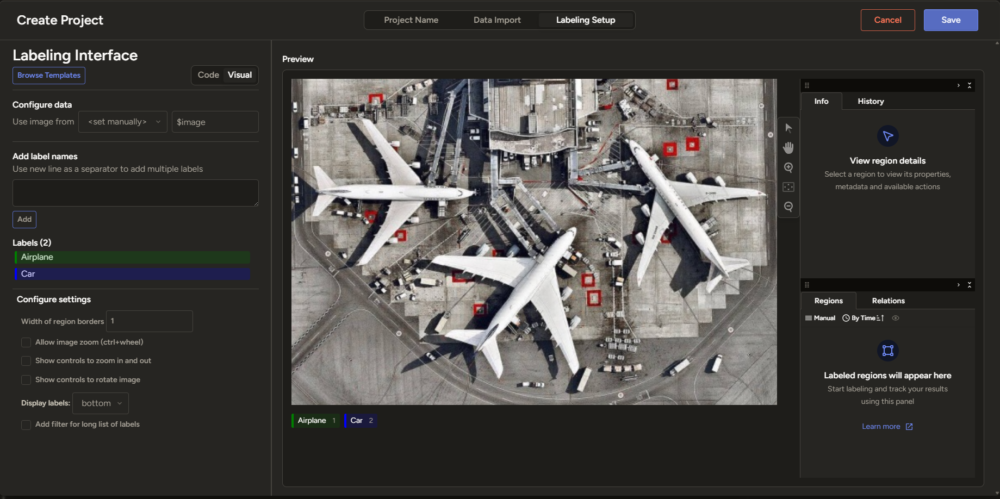

จะขึ้นหน้านี้ จากนั้นกด Connect Cloud Storage แล้วเลือก Local File กด Next   

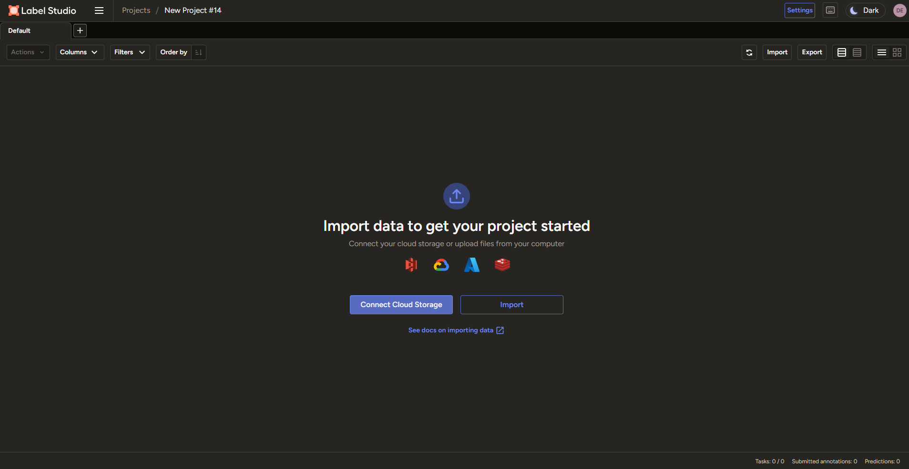

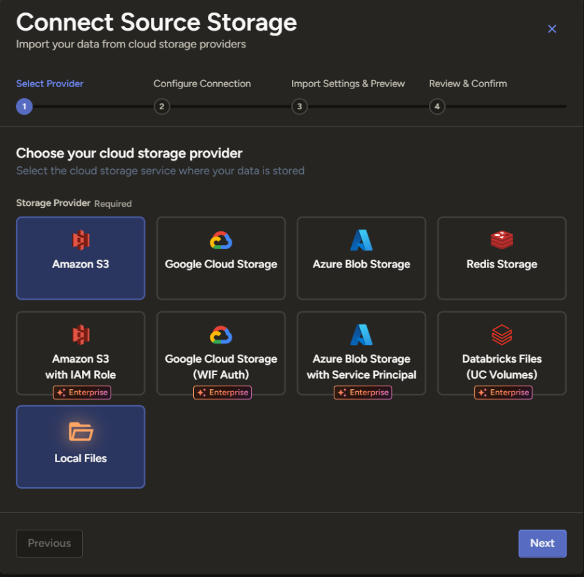

หน้านี้ให้ตั้ง Storage Title เป็นอะไรก็ได้เช่น Training data แล้ว Absolute local path ตรงนี้สำคัญ ใส่ชื่อโฟลเดอร์ที่เรามีรูปภาพอยู่ ของที่ทำไว้เป็น Frame ก็จะใส่ตามรูป จากนั้นกด Test Connection ดูว่าสามารถต่อกับ local storage ได้ไหม หากกดแล้วกลายเป็นสีเขียว ก็แสดงว่าใช้ได้ แล้ว กด Next  ได้เลย   

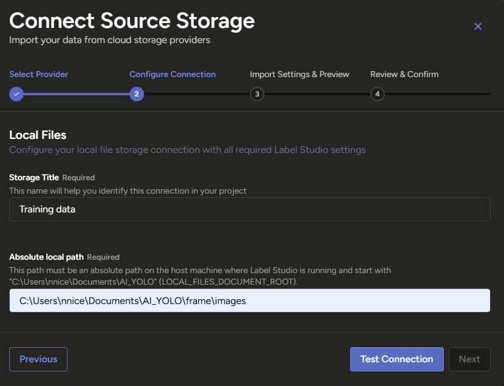

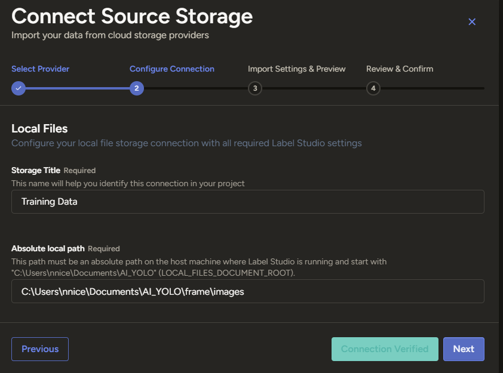

หน้านี้ ให้เปลี่ยนจาก Tasks เป็น Files แล้วกด Load Preview เราจะเห็นไฟล์ที่เรา import เข้าไปเช็คดูถ้าถูกแล้วก็ Next ได้เลย   

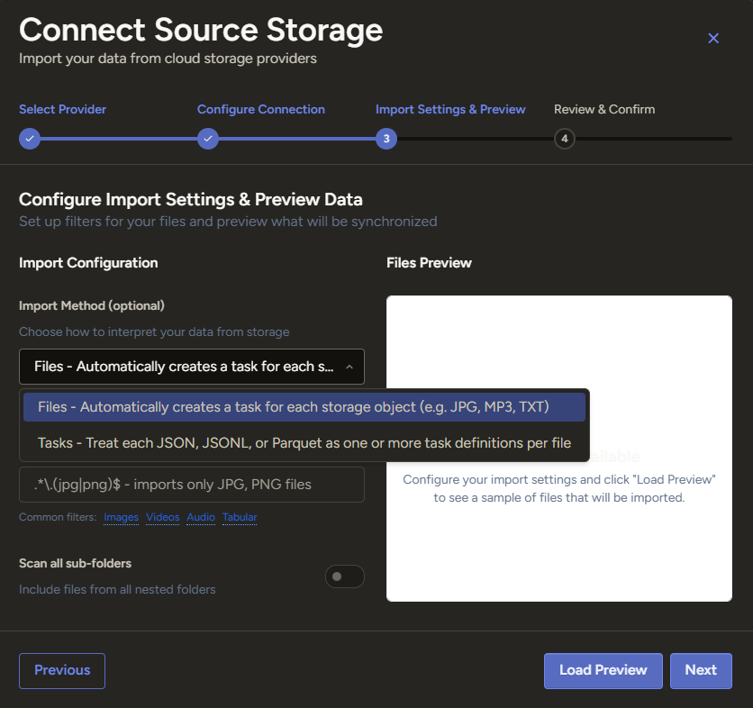

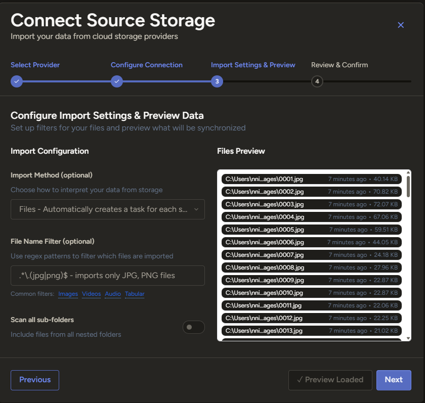

หน้านี้ให้กด Save & Sync ได้เลย แล้วจะได้ข้อมูลรูปภาพเข้ามาแล้ว

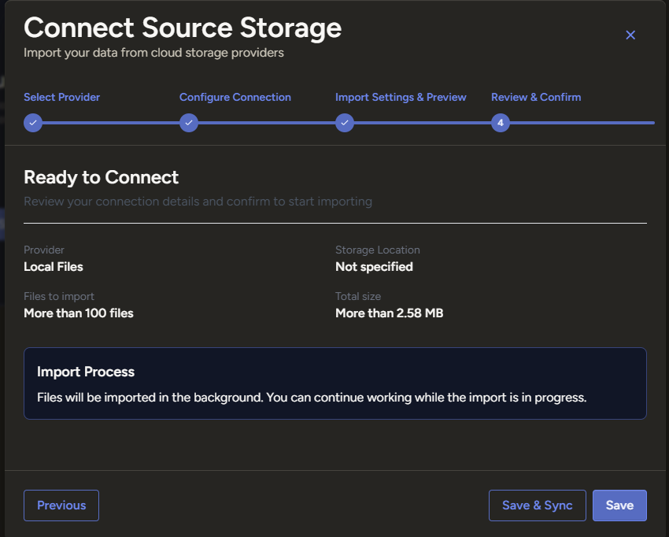

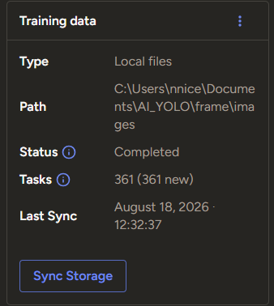

กดกลับมาที่หน้า Project จากนี้จะเข้าไป setting เพื่อสร้าง  label มาแปะไว้บนภาพของเรา เพื่อบ่งบอกถึงสิ่งของที่ใช้ Bounding Box ครอบไว้ กด Setting

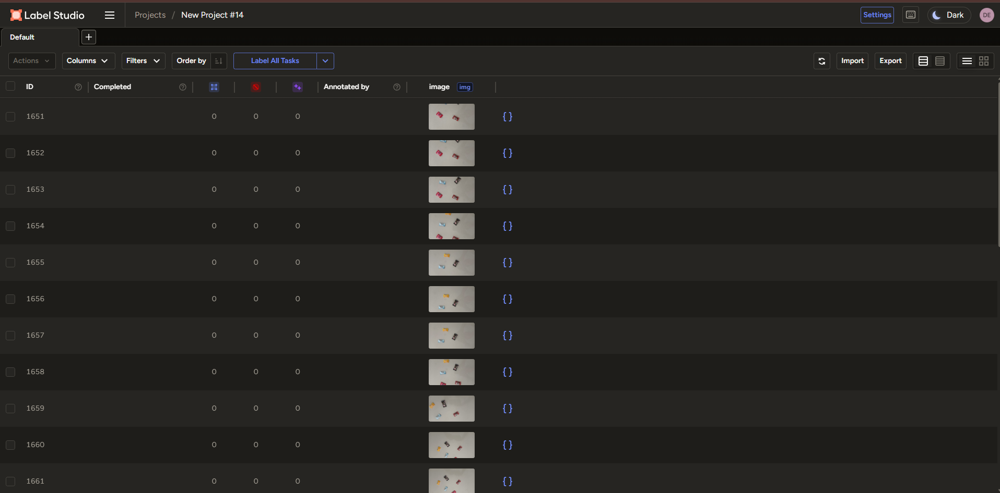

แล้วเข้ามาหน้า Labeling Interface เราสามารถเพิ่ม หรือลบ Class  เริ่มต้นไว้ได้ สามารถเพิ่มได้เองหรือใช้โค้ดก็ได้ ในกรณีนี้จะให้โค้ดไปวาง เพื่อปรับให้ Class ตรงกับตัวอย่าง ให้เปลี่ยนบนจาก Visual ข้างบน เป็น Code แล้ววางโค้ดนี้ลงไปแทนโค้ดเดิมได้เลย   

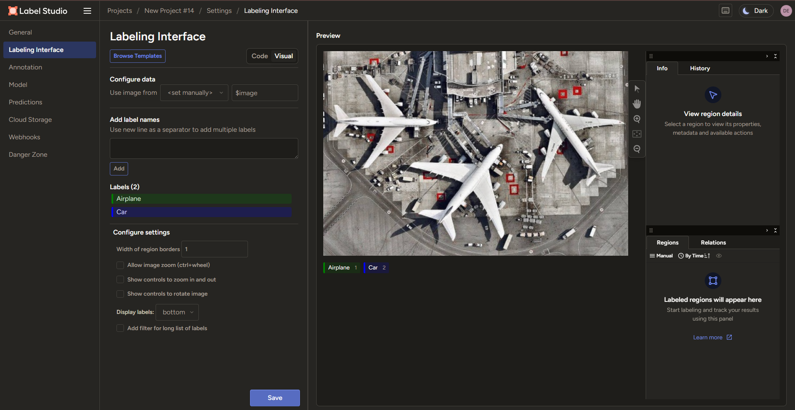

---

## Classes

ตัวอย่าง Class ที่ใช้ใน Dataset นี้ ได้แก่

```text
HB
KOPIKO
HACKS
HALLS
MYM
```

Class ที่ใช้จริงควรตรงกับวัตถุที่ต้องการตรวจจับใน Dataset

ตัวอย่าง Labeling Interface:

```xml
<View>
  <Image name="image" value="$image"/>

  <RectangleLabels name="label" toName="image">
    <Label value="HB" background="#9f0909"/>
    <Label value="KOPIKO" background="#000000"/>
    <Label value="HACKS" background="#FFA39E"/>
    <Label value="HALLS" background="#AD8B00"/>
    <Label value="MYM" background="#007ebd"/>
  </RectangleLabels>
</View>
```

> ข้อควรระวัง ในการทำ Label  ควรมีแค่  Class ที่ได้ใช้จริง ส่วนตัวไหนไม่ได้ใช้ไม่ต้องใส่

พอได้แล้วกด Save ได้เลย จากนั้นกดกลับไปหน้า Project ของเราแล้วกดเข้าไปในรูปได้เลย

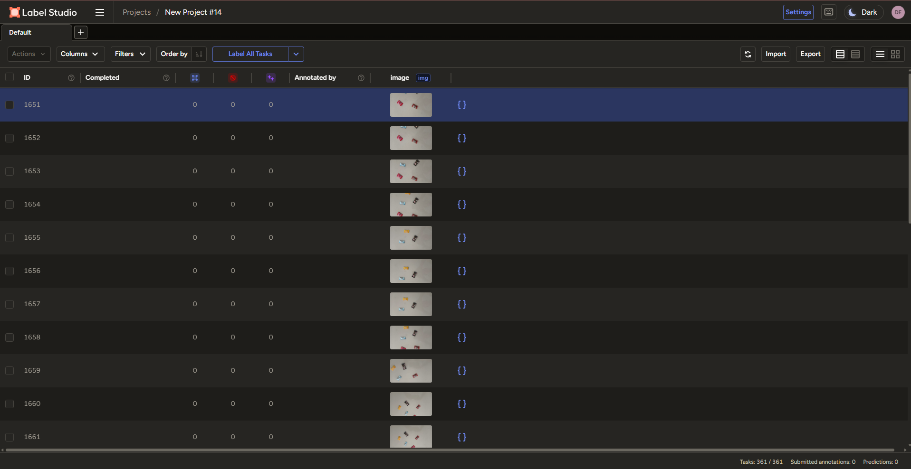

จะถูกส่งมาหน้านี้ จากนั้นจะเริ่มทำ Label แล้ว   

---

# ✏️ ทำ Bounding Box


เลือกภาพที่ต้องการ Label แล้วลาก Bounding Box ครอบวัตถุ

สามารถใช้คีย์ลัด

```text
1  → Class 1
2  → Class 2
3  → Class 3
4  → Class 4
5  → Class 5
```

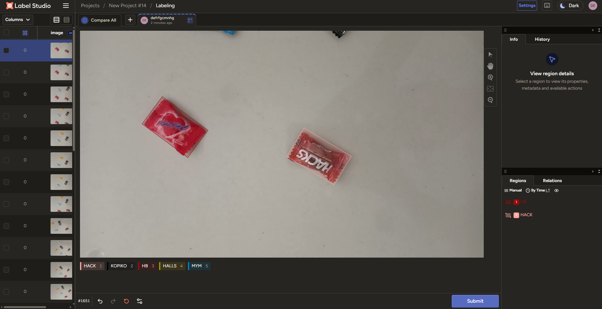

พอเสร็จ 1 ภาพแล้วกด `submit` ได้เลย ระบบจะบันทึกประวัติการทำของเราไปแล้ว จากนั้นก็เลือกภาพอื่นด้านข้างเพื่อทำ Label ต่อไป

***สามารถเลือก Label เฉพาะภาพที่ต้องการได้ ไม่จำเป็นต้อง Label ทุกภาพก่อน Export***

---

# 📤 Export Annotation

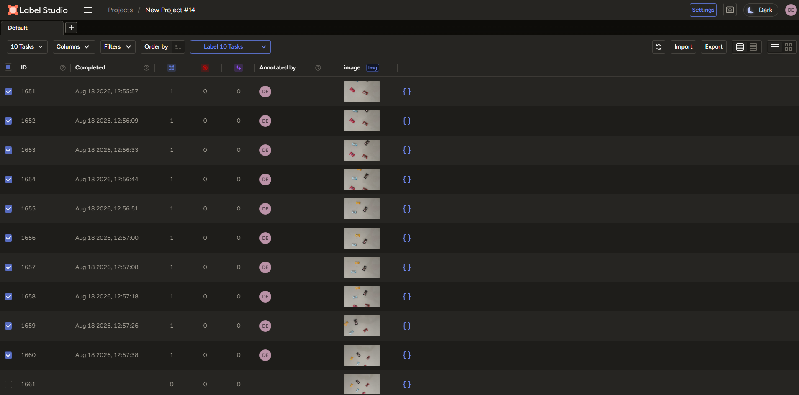

หลังจาก Label เสร็จแล้ว

1. กลับไปหน้า Project
2. เลือกภาพที่ต้องการ Export
3. กด **Export**
4. เลือกรูปแบบ **JSON**
5. กด Export

ระบบจะสร้างไฟล์ `.json`   

จากนั้นนำไฟล์ json นี้ไปลงไว้ใน โฟลเดอร์ AI_YOLO ที่เปิด Vs Code ไว้ได้เลย เพื่อเตรียม export .txt ให้ตรงกับภาพที่ใช้ label เพื่อให้พร้อม train yolo26 ได้เลย   

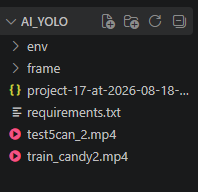

ดาวน์โหลดไฟล์ต่างๆ แล้วนำเข้าโฟลเดอร์ AI_YOLO เราจะใช้ 01-export_dataset.py ในการ export .json ของเราให้เป็น .txt   

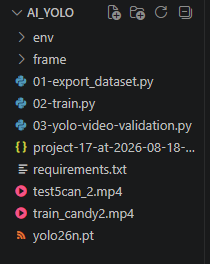

---

# 🔄 Convert Label Studio JSON → YOLO Dataset

เปิดไฟล์

```text
01-export_dataset.py
```

และแก้ไข Path ให้ตรงกับเครื่อง

```python
SCRIPT_DIR = Path(__file__).resolve().parent
IMAGES_DIR = Path(r"C:\Users\nnice\Documents\AI_YOLO/frame/images")
OUTPUT_DIR = Path(r"C:\Users\nnice\Documents\AI_YOLO/dataset")
TRAIN_SPLIT = 0.8 
SEED = 42
```

### IMAGES_DIR

ใส่ path ที่เก็บรูปภาพที่เราแยก frame มาจาก video ของเรา

### OUTPUT_DIR

ใส่ path ที่ต้องการให้สร้างโฟลเดอร์ dataset มาใหม่

### TRAIN_SPLIT

สัดส่วนของ Training Dataset 

```python
TRAIN_SPLIT = 0.8
```

หมายถึง

```text
Training = 80%
Validation = 20%
```

สามารถเปลี่ยนค่าได้ตามต้องการ

### SEED

ใช้สำหรับควบคุมการสุ่ม Dataset ให้สามารถทำซ้ำได้

---

## Run Dataset Conversion

จากนั้นไปที่ cmd แล้วรันโค้ด python 01-export_dataset.py ถ้าขึ้นแบบนี้คือได้แล้ว และจะได้ โฟลเดอร์ dataset มาแล้ว   

```bash
python 01-export_dataset.py
```

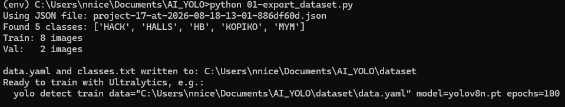

---

# 🧠 Train YOLO26

โมเดลที่ใช้เริ่มต้นคือ

```text
yolo26n.pt
```

การ Train กำหนดค่าหลักดังนี้

```text
Epochs       : 50
Image Size   : 640
Optimizer    : MuSGD
Device       : 0
```

พร้อมใช้ Data Augmentation เช่น

```text
degrees      = 7.0
shear        = 5.0
perspective  = 0.001
fliplr       = 0.5
flipud       = 0.5
mosaic       = 0.1
mixup        = 0.1
close_mosaic = 10
```

สามารถดูและแก้ไขค่าต่าง ๆ ได้ใน

```text
02-train.py
```

---

## Run Training

```bash
python 02-train.py
```

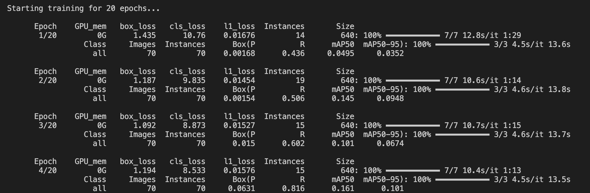

เมื่อเทรนเสร็จจะได้หน้าตาแบบนี้

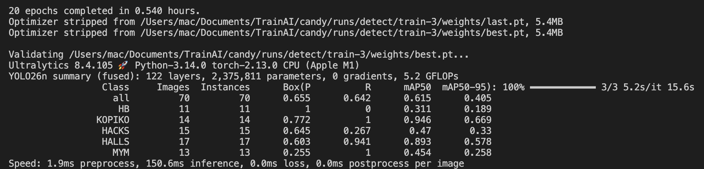

---

# 🧪 Test Model

## 1. Test Image

เปิดไฟล์

```text
03-test_image.py
```


แก้ชื่อไฟล์ภาพที่ต้องการทดสอบ

```python
results = model.predict("FILE_NAME", conf=0.01, save=True)
```

จากนั้นรัน

```bash
python 03-test_image.py
```

ผลลัพธ์จะถูกบันทึกโดยระบบ Ultralytics และสามารถดูภาพที่ตรวจจับแล้วได้


---

# 🎥 2. Test Video

ไฟล์ที่ใช้ทดสอบคือ

```text
04-test_video.py
```

กำหนดไฟล์วิดีโอ เช่น

```python
video_to_test = "video_candy1.MOV"
```

รันคำสั่ง

```bash
python 04-test_video.py
```

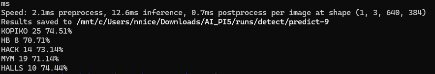

ผลลัพธ์จะถูกบันทึกไว้ใน

```text
runs/detect/predict
```

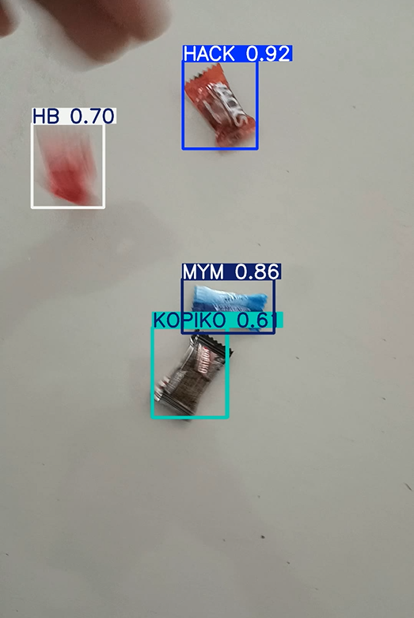

---

# 📷 3. Test Camera

สำหรับการตรวจจับวัตถุแบบ Real-time ผ่านกล้อง Webcam ใช้ไฟล์

```text
05-test-camera.py
```

รันด้วย

```bash
python 05-test-camera.py
```

ระบบจะเปิดกล้องและแสดงผลการตรวจจับแบบ Real-time

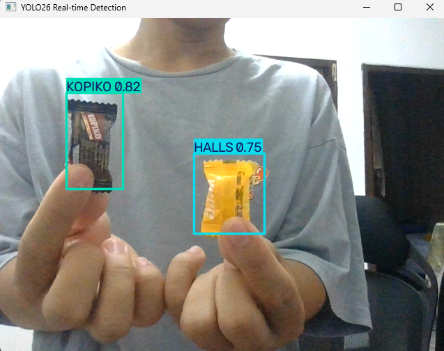

กด

```text
q
```

เพื่อออกจากโปรแกรม

---

# ⚠️ Notes

* ต้องตรวจสอบ Path ในไฟล์ Python ให้ตรงกับตำแหน่งไฟล์จริงในเครื่อง
* `01-export_dataset.py` ต้องมีไฟล์ JSON ที่ Export จาก Label Studio อยู่ในโฟลเดอร์เดียวกัน
* ภาพที่ใช้ Label ต้องตรงกับภาพที่ระบุใน JSON
* ควรใช้ Class เฉพาะที่มีอยู่จริงใน Dataset
* ก่อน Train ควรตรวจสอบว่า `data.yml` ชี้ไปยัง Dataset ที่ถูกต้อง
* หากใช้ GPU ต้องตรวจสอบว่า PyTorch และ CUDA สามารถทำงานร่วมกับอุปกรณ์ของเครื่องได้
* หากไม่มี GPU สามารถปรับ `device` ในไฟล์ Training ให้เหมาะสมกับเครื่อง


